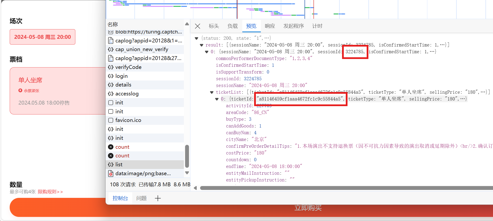

# 秀动简易脚本

## 使用方法

-   请先在脚本顶部预填**演出 id 和门票 id**，可以通过在浏览器打开演出信息页，点出场次/票种列表后在开发者面板中找到；也需要预填写开抢时间，并校准本机时钟；还需要预填**所有观演人的名字**，并提前在手机端添加要抢的观演人
    -   
-   初次启动脚本后，会要求从浏览器登陆，输入手机号验证码登录。登陆后 session 会被保存，下次会使用 session 自动登录（但我并不知道 session 有效期是多久……）
-   登录后脚本的工作步骤：
    -   刷新确认购票页面
    -   勾选观演人信息
    -   睡眠到下一分钟 0 秒
    -   若已经到了开抢时间且全局变量 `FLAG == True`
        -   点击抢票按钮
        -   等待用户输入，此时可以确认是否成功抢票（提示支付后就可以上手机支付了）
        -   按下回车后，脚本会重复上述步骤，但是跳过睡眠，直接再次尝试抢票
    -   否则，循环
-   因为不知道有没有验证码，所以点击抢票后只会循环再试，请随时准备接管

## 提示

-   不要尝试开多个脚本一起抢，因为 web 端之间会踢掉对方的登录
